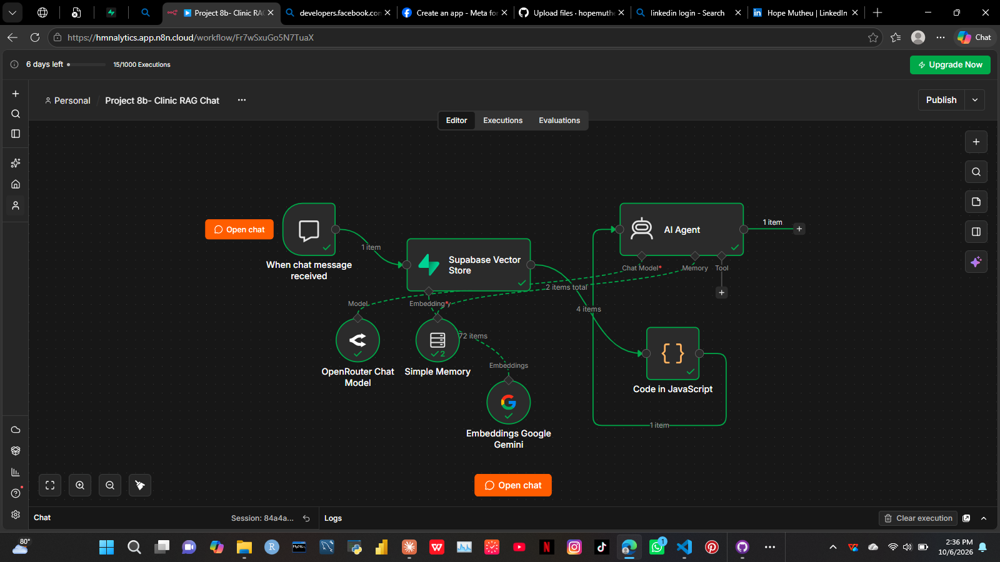

# Clinic RAG Assistant (n8n + Supabase)

A retrieval-augmented chatbot that answers patient questions about a fictional clinic using only its own knowledge base. Every reply is tagged `INFO`, `EMERGENCY` or `HANDOFF`, so urgent or out-of-scope messages can be routed to a human.

## How it works

The project has two n8n workflows.

### 1. Knowledge ingestion (`8a-clinic-knowledge-ingestion.json`)

- Runs manually when the knowledge base changes.
- Reads the clinic knowledge base from a Google Doc.
- Splits the text into chunks with the Default Data Loader.
- Creates embeddings with Google Gemini.
- Stores the chunks and embeddings in Supabase (pgvector).
- Sample run: the clinic Google Doc was split into 5 chunks and stored in Supabase.

### 2. RAG chat (`8b-clinic-rag-chat.json`)

- Receives a patient message through the n8n chat trigger.
- Searches the Supabase vector store for the most relevant chunks.
- A JavaScript Code node processes the retrieved chunks before they reach the agent.
- Passes the chunks to an AI Agent (OpenRouter chat model, with simple memory).
- The agent answers using only the retrieved excerpts.

## Safety design

- Never
